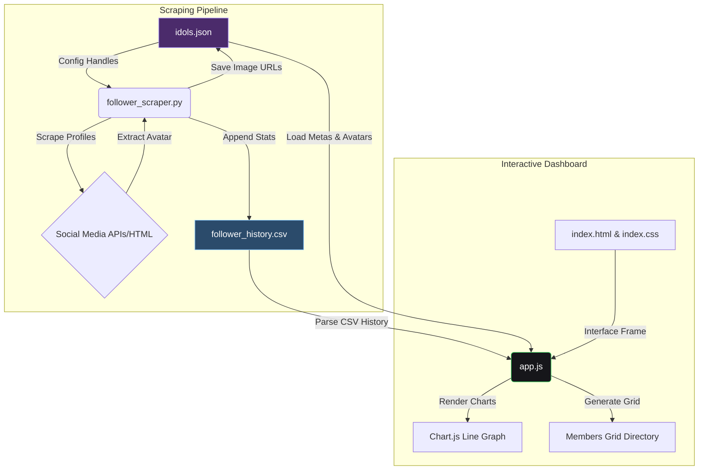

# Catsolute: Idol Follower Analytics Dashboard & Scraper

An offline-first, high-fidelity web application and data pipeline designed to scrape, track, and interactively analyze the social media growth of members and group channels under the **Catsolute** agency.

---

## 🚀 Application Architecture Overview

The system consists of two major components:
1. **The Python Scraping Pipeline**: Pulls weekly follower metrics across X, Instagram, Facebook, and TikTok, extracts high-res X avatar pictures, and appends records to a CSV database.
2. **The Interactive Web Dashboard**: A vanilla HTML5/CSS3/JavaScript web app powered by Chart.js to display timeline trends, filter profiles, sort by handles or metadata, and compare growth curves.



---

## 🛠️ Data Pipeline & Components

### 1. Data Configuration: `idols.json`
Stores the metadata for all 5 official group channels and 40 individual member profiles:
* **Schema Attributes**:
  * `"name"`: Display name of the member or group.
  * `"type"`: `"group"` (Official channel) or `"member"`.
  * `"group"`: Group name (e.g. *Sora! Sora!*, *Yami Yami*, *Mirai Mirai*, *Dream:0n*, *Nox:0ff*).
  * `"color"`: Representative theme color keyword (e.g. *Purple, Pink, Green*).
  * `"instagram_handle"`, `"x_handle"`, `"facebook_page"`, `"tiktok_handle"`: Platform identifiers.
  * `"x_avatar_url"`: Cached high-resolution (`400x400`) profile picture URL.

### 2. Follower Database: `follower_history.csv`
A database holding weekly snapshots from **2026-06-24** onwards.
* **Fields**: `Date,Timestamp,Idol_Name,Platform,Username,Follower_Count`

### 3. Scraping Script: `follower_scraper.py`
A unified Python pipeline that:
* Iterates through all accounts inside `idols.json`.
* Scrapes follower metrics from public HTML pages without requiring API credentials.
* Performs dimensions substitution (`_200x200` to `_400x400`) to fetch high-res X avatar pictures and saves them back to `idols.json`.
* Appends new stats records (with Date and Timestamp) to `follower_history.csv` at execution runtime.

### 4. Avatar Scraper: `x_image_scraper.py`
A utility script and Jupyter Notebook (`x_image_scraper.ipynb`) that:
* Accepts one or more X/Twitter profile handles/URLs.
* Crawls public profiles to scrape and returns direct high-resolution (`400x400`) avatar URLs without API credentials.

---

## 💻 Web App Frontend Features

### 📅 Chart Date Range Slicers
* Filter timeline growth curves dynamically using the **"From"** and **"To"** select dropdowns.
* Dates populate automatically from unique CSV snapshots.

### 🔀 Decoupled Platform and Directory Filters
* **Platform Selector**: An SNS dropdown (`Instagram, X, Facebook, TikTok`) in the chart header controls what metric is plotted.
* **Directory Filters**: Sort the card directory by **Member Name (A-Z)**, **Group Name (A-Z)**, or **Member Color**, fully decoupled from the chart plotted platform.
* Group and Color filters at the bottom dynamically update the graph datasets to show matching members.

### 📊 Synced Glowing Selection States
* Cards currently plotted on the graph (e.g. the top 10 members by default, or filtered groups) **automatically display a white selection outline and a checkmark bubble** without requiring user clicks.
* Clicking the red **"Clear Selection"** button resets all highlights at once.

### 🔗 Clickable Profile Metric Badges
* Platform rows inside each card are wrapped in external hyperlink anchors (`<a>`).
* Clicking any metric card opens that member's specific handle directly in a new tab.

### 🎨 Color-Matched Legend Labels
* Dataset legend labels match the exact colors of the trend lines (with the rectangle indicators removed for a cleaner look).
* The selected member name in the graph title displays styled in their representative theme color.

---

## 🚀 Getting Started

### 1. Run the Daily Scraper Orchestrator
To update X avatars, scrape all follower stats concurrently, generate alerts, and run data synthesis in a single run:
```bash
python3 daily_workflow.py
```

### 2. Serve the Dashboard Locally
Run a lightweight HTTP server:
```bash
python3 -m http.server 8000
```
Open your browser and navigate to:
👉 **[http://localhost:8000](http://localhost:8000)**

---

## 🎨 Technology Stack
* **Frontend Structure**: HTML5 (Semantic elements)
* **Styling**: CSS3 (Vanilla + HSL glow gradients + CSS variables + Flexbox/Grid)
* **Logic**: Vanilla ES6 JavaScript (No heavyweight dependencies)
* **Visualization Library**: Chart.js (v4)
* **Icons**: Inline SVGs & Lucide Icons (CDN)
* **Backend**: Python 3 (Requests, BeautifulSoup4)
