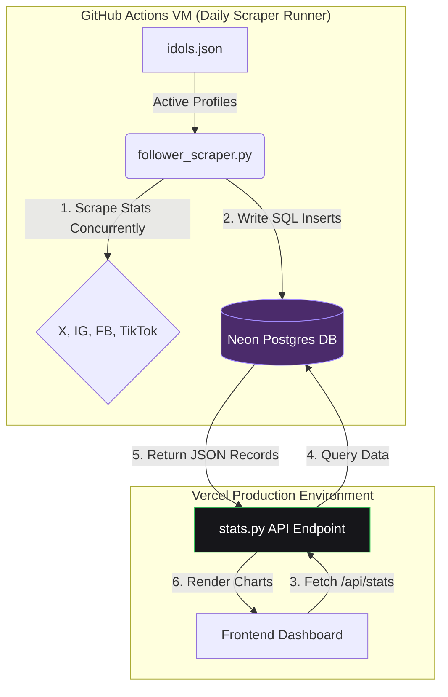

# Catsolute: Idol Follower Analytics Dashboard & Scraper

An offline-compatible, high-fidelity serverless web application and data pipeline designed to scrape, track, and interactively analyze the social media growth of members and group channels under the **Catsolute** agency.

---

## 🚀 Serverless Application Architecture

The system is built on a modern, distributed serverless architecture that maintains 100% free-tier compatibility:



1. **The Python Scraping Pipeline (GitHub)**: Executed daily in virtual GitHub Actions runner instances, it scrapes X, Instagram, Facebook, and TikTok concurrently, extracts avatars, resolves rate-limits with backoff logic, writes updates directly to Neon Postgres, and dispatches automated status/failure summaries to your Lark Group Chat.
2. **The Cloud database (Neon Postgres)**: Serves as the single source of truth for stats history, resolving duplicate runs via a unique key constraint and handling missing-data interpolation.
3. **The Serverless API & Dashboard (Vercel)**: A high-performance dashboard that queries the database via serverless functions (`/api/stats`), with built-in backward compatibility to load local CSV files if database access is unavailable (e.g. during local offline testing).

---

## 🛠️ Data Pipeline & Components

### 1. Data Configuration: `idols.json`
Stores the metadata for all 5 official group channels and 40 individual member profiles:
* **Schema Attributes**:
  * `"name"`: Display name of the member or group.
  * `"type"`: `"group"` (Official channel) or `"member"`.
  * `"group"`: Group name (*Sora! Sora!*, *Yami Yami*, *Mirai Mirai*, *Dream:0n*, *Nox:0ff*).
  * `"color"`: representative theme color keyword.
  * `"instagram_handle"`, `"x_handle"`, `"facebook_page"`, `"tiktok_handle"`: Platform identifiers.
  * `"x_avatar_url"`: Cached high-resolution (`400x400`) profile picture URL.

### 2. Database Engine: PostgreSQL (`follower_history` table)
*   **Table Schema**: Contains columns for `date`, `timestamp`, `idol_name`, `platform`, `username`, and `follower_count`.
*   **Unique Constraint**: Enforces a `UNIQUE (date, idol_name, platform)` composite key, which acts as the partition key for daily reruns and lets jobs safely overwrite counts without duplicating data.
*   **Fallback Backup**: Appends new logs to a local backup file (`follower_history.csv`) if the database connection is not configured.

### 3. Scraping Engine: `follower_scraper.py`
A parallelized scraping script that:
*   Executes HTTP platform queries (X, Instagram, Facebook) concurrently using a `ThreadPoolExecutor` (10 workers).
*   Executes browser platform queries (TikTok) sequentially using Playwright.
*   **Loop-Based Retries**: Automatically retries failed channels inside a loop every 2 minutes. The scraper times out at 15 minutes, logs remaining failures to a platform-specific JSON file, and exits.
*   **Error Recovery**: Loads today's previous data as backups. If a rerun fails or returns `0`, it falls back to the backup values.

#### 🔍 Scraper Platforms & Layers
For maximum resilience against datacenter IP bans and rate-limiting on cloud runners, the scraper checks multiple sources for each social media platform in order:

##### 📷 Instagram
1.  **Layer 1 (SocialBlade - Exact Count)**: Checks `socialblade.com/instagram/user/{username}`. It extracts the raw React state payload (`__NEXT_DATA__` tag) to retrieve the exact integer follower count without requiring login authentication.
2.  **Layer 2 (Instastatistics - Exact Count)**: If the profile is not indexed on SocialBlade (returns 404) or is blocked, the scraper queries `instastatistics.com/{username}` and parses its HTML metadata.
3.  **Layer 3 (Direct Profile Scrape - Rounded Count)**: If both fail, it falls back to crawling `instagram.com/{username}/` directly using a Googlebot user-agent. If Instagram redirects to a login wall 3 times, the scraper raises a rate-limit error.

##### 🐦 X (Twitter) & Avatar Monitor
1.  **Layer 1 (Direct Profile Scrape - Exact Count)**: Loads `x.com/{username}` and uses regular expressions to find the exact, unrounded follower count embedded in the page source.
2.  **Avatar Extractor**: Locates the profile image meta tag (`og:image`), strips out thumbnail suffixes (like `_normal` or `_bigger`), replaces it with `_400x400` to get the high-resolution original avatar, and writes it to `idols.json`.

##### 👤 Facebook
1.  **Layer 1 (SocialBlade - Exact Count)**: Only for standard usernames (excluding numeric `profile.php?id=` URLs), queries `socialblade.com/facebook/user/{username}` and parses the `__NEXT_DATA__` React JSON payload for the exact likes count.
2.  **Layer 2 (Direct Page Scrape - Rounded Count)**: Falls back to crawling `facebook.com/{username}` directly using a Googlebot user-agent. It parses the meta description tag to extract likes or followers.

##### 🎵 TikTok
1.  **Layer 1 (Headless Browser Scrape - Exact Count)**: Launches a hidden Chromium browser session using Playwright to bypass initial client-side loading walls.
2.  **React State Parser**: Navigates to `tiktok.com/@{username}` and searches the page HTML source code for the `"statsV2"` hydrated state JSON data (specifically the `followerCount` property) to retrieve the exact count.
3.  **DOM Text Fallback**: If the React State JSON is missing, it reads the visible text from the `[data-e2e="followers-count"]` UI element.

---

## 💻 Web App Frontend Features

### 📅 Chart Date Range Slicers
* Filter timeline growth curves dynamically using the **"From"** and **"To"** select dropdowns, automatically loaded from unique database snapshots.

### 🔀 Decoupled Platform and Directory Filters
* **Platform Selector**: An SNS dropdown (`Instagram, X, Facebook, TikTok`) in the chart header controls what metric is plotted.
* **Directory Filters**: Sort the card directory by **Member Name (A-Z)**, **Group Name (A-Z)**, or **Member Color**, fully decoupled from the chart plotted platform.
* Group and Color filters at the bottom dynamically update the graph datasets to show matching members.

### 📊 Synced Glowing Selection States
* Cards currently plotted on the graph (e.g. the top 10 members by default, or filtered groups) **automatically display a white selection outline and a checkmark bubble** without requiring user clicks.
* Clicking the red **"Clear Selection"** button resets all highlights at once.

### 🔗 Clickable Profile Metric Badges
* Platform rows inside each card are wrapped in external hyperlink anchors (`<a>`). Clicking any metric card opens that member's specific handle directly in a new tab.

### 🎨 Color-Matched Legend Labels
* Dataset legend labels match the exact colors of the trend lines (with the rectangle indicators removed for a cleaner look).
* The selected member name in the graph title displays styled in their representative theme color.

---

## 🚀 Deployment & Operations

### 1. Vercel Hosting & Serverless Setup
*   **Dashboard Deployment**: Linked to your GitHub repository and automatically redeploys on every git commit.
*   **Serverless API**: Exposes the python function `/api/stats` to fetch Postgres records as JSON.
*   **Integration**: Neon Postgres is linked via the Vercel integrations dashboard, exposing the `POSTGRES_URL` connection secret at runtime.
*   **Web Analytics & Speed Insights**: Integrates Vercel's real-time visitor analytics and PageSpeed performance monitoring (configured via vanilla script tags in `index.html`'s head).
*   **Offline Development**: Running `python3 -m http.server 8000` will run the app locally, automatically falling back to parsing the local `follower_history.csv` dataset.

### 2. GitHub Actions Scheduled Jobs
*   **File Location**: `.github/workflows/daily_scrape_workflow.yml`
*   **Automation**: Runs daily at midnight UTC.
*   **Environment Secret**: Requires the `POSTGRES_URL` secret to be added inside your GitHub repository settings under **Settings -> Secrets and Variables -> Actions -> Repository Secrets**.
*   **Lark Notifications**: At the end of every run, it automatically triggers a POST request to your Lark custom bot webhook, reporting scraping statistics (expected vs. successful counts) and a detailed bulleted list of any missing or failed accounts.
*   **Real-time Logs**: You can view the status and live crawler stdout at:
    🔗 [https://github.com/pavinss2/thaidoru-stats/actions](https://github.com/pavinss2/thaidoru-stats/actions)

### 3. Adhoc Runs & Manual Migrations

If you need to manually upload statistics or run targeted scraper jobs on specific members, you can use the following scripts:

#### A. Migrate Local CSV History to Neon Postgres
To copy your local `follower_history.csv` data into the Neon database (which resolves duplicate runs via key conflicts and runs linear database interpolation):
```bash
python3 import_csv_to_postgres.py
```
*(This script will automatically read credentials from your local `.env.local` file).*

#### B. Run Targeted Adhoc Scraping for Specific Members
To run the scraper on-demand for specific members (e.g., Best, Pin, Praew) and save their counts directly into your Neon PostgreSQL database:
```bash
python3 adhoc_scrape.py Best Pin Praew
```
You can pass any list of member names separated by spaces.

---

## 🎨 Technology Stack
* **Frontend**: HTML5 (Semantic elements)
* **Styling**: CSS3 (Vanilla HSL gradients + Glassmorphism + Flexbox/Grid)
* **Visualization**: Chart.js (v4)
* **Icons**: Inline SVGs & Lucide Icons (CDN)
* **Backend**: Python 3 (Requests, BeautifulSoup4, Playwright, Psycopg2)
* **Database**: Serverless PostgreSQL (Neon)
